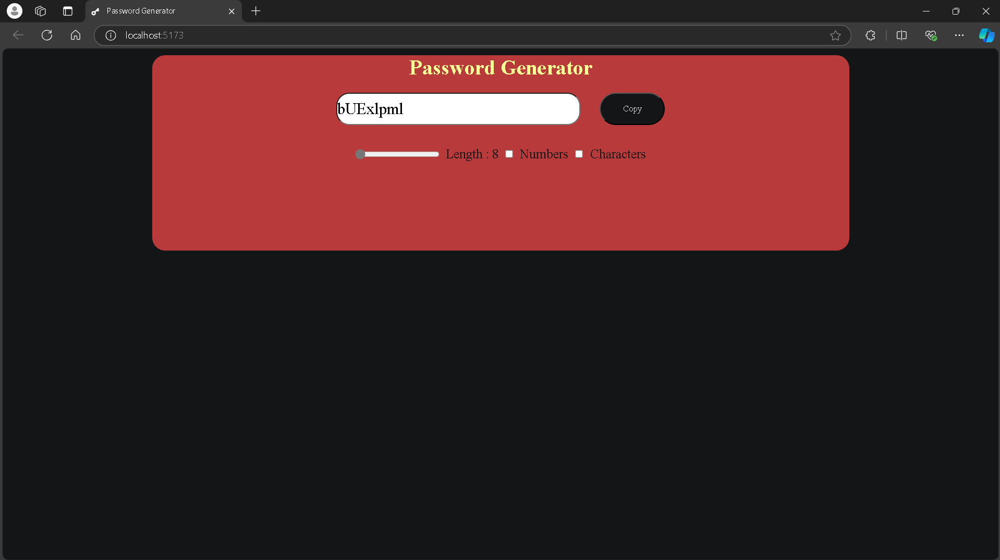

# Password Generator

A simple and efficient password generator built with React.js and Vite. This application allows users to generate secure passwords with customizable options.

## Features

- Generate random passwords with varying lengths.
- Include/exclude numbers, and symbols.
- User-friendly interface with real-time updates.
- Copy password on one click


## Tips




## Installation

1. Clone the repository:
   ```bash
   git clone https://github.com/Aakash768/Password-Generator/.git


# React + Vite

This template provides a minimal setup to get React working in Vite with HMR and some ESLint rules.

Currently, two official plugins are available:

- [@vitejs/plugin-react](https://github.com/vitejs/vite-plugin-react/blob/main/packages/plugin-react/README.md) uses [Babel](https://babeljs.io/) for Fast Refresh
- [@vitejs/plugin-react-swc](https://github.com/vitejs/vite-plugin-react-swc) uses [SWC](https://swc.rs/) for Fast Refresh
